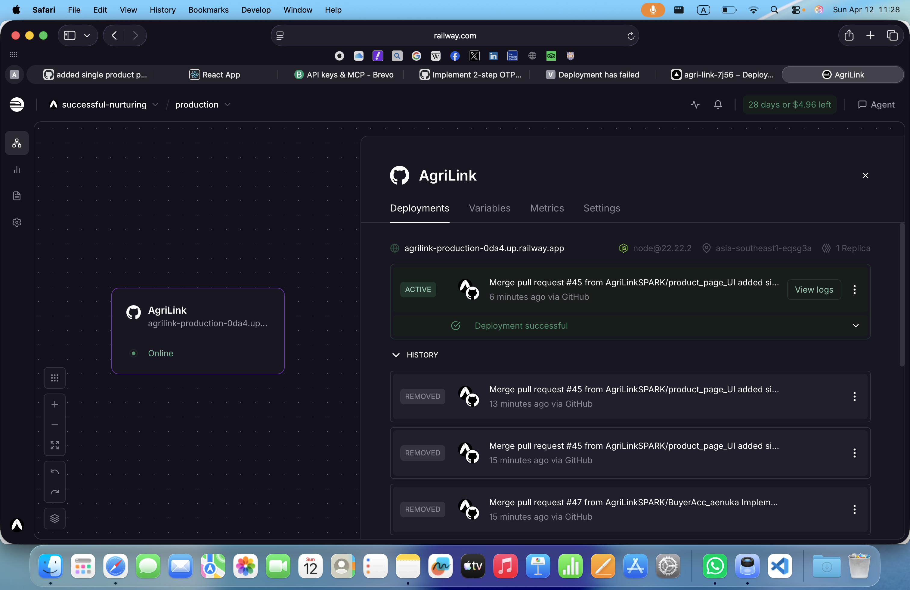
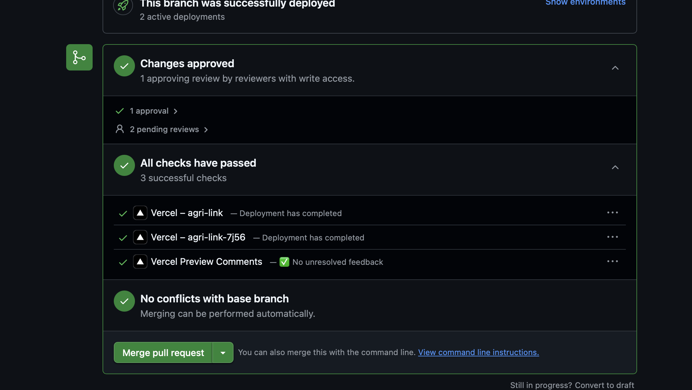

# AgriLink

AgriLink is a marketplace web application that helps small farmers sell produce directly to customers.

## Tech Stack

- Backend: Node.js, Express.js, MongoDB
- Frontend: React (Create React App)
- Payments: Stripe
- Media: Cloudinary (optional)
- Notifications: Brevo / SMTP / Twilio / Dialog SMS (optional)

## Deployment

This section satisfies the deployment documentation requirements for both backend and frontend.

### 1. Backend Deployment (Render or Railway)

Recommended platform: Render

Setup steps:

1. Push the latest code to GitHub.
2. In Render, create a new Web Service and connect this repository.
3. Configure service settings:
	- Root Directory: `backend`
	- Build Command: `npm install`
	- Start Command: `npm start`
4. Add backend environment variables listed below (keys only, no secrets).
5. Deploy and copy the generated backend URL.
6. Verify:
	- `https://<backend-domain>/`
	- `https://<backend-domain>/api-docs`

Alternative backend platform: Railway

1. Create a new project on Railway.
2. Connect this repository and set root directory to `backend`.
3. Use build command `npm install` and start command `npm start`.
4. Add the same backend environment variables.
5. Deploy and verify endpoints.

### 2. Frontend Deployment (Vercel or Netlify)

Recommended platform: Vercel

Setup steps:

1. Create a new project in Vercel and import this repository.
2. Set project Root Directory to `frontend`.
3. Configure build settings:
	- Build Command: `npm run build`
	- Output Directory: `build`
4. Add frontend environment variables listed below.
5. Deploy and copy the generated frontend URL.
6. Update backend `CLIENT_URL` (and optionally `CLIENT_URLS`) to include the deployed frontend domain, then redeploy backend.
7. Verify frontend pages and API calls in browser DevTools.

Alternative frontend platform: Netlify

1. Import this repository in Netlify.
2. Set Base Directory to `frontend`.
3. Set Build Command to `npm run build` and Publish Directory to `build`.
4. Add the same frontend environment variables.
5. Deploy and verify app routing and API calls.

### 3. Environment Variables Used (No Secrets Exposed)

#### Backend (.env)

Required:

- `NODE_ENV`
- `PORT`
- `MONGO_URI`
- `JWT_SECRET`
- `JWT_EXPIRE`
- `CLIENT_URL`
- `STRIPE_SECRET_KEY`
- `STRIPE_WEBHOOK_SECRET`
- `STRIPE_CURRENCY`

Common optional variables used by project features:

- `CLIENT_URLS`
- `FRONTEND_URL`
- `CLOUD_NAME`
- `CLOUD_API_KEY`
- `CLOUD_API_SECRET`
- `BREVO_API_KEY`
- `EMAIL_FROM`
- `EMAIL_FROM_NAME`
- `SMTP_HOST`
- `SMTP_PORT`
- `SMTP_SECURE`
- `SMTP_USER`
- `SMTP_PASS`
- `ALLOW_LOGIN_WHEN_OTP_EMAIL_FAIL`
- `ALLOW_CONSOLE_OTP_FALLBACK`
- `TWILIO_ACCOUNT_SID`
- `TWILIO_AUTH_TOKEN`
- `TWILIO_PHONE_NUMBER`
- `TWILIO_WHATSAPP_FROM`
- `TWILIO_WHATSAPP_CONTENT_SID`
- `TWILIO_WHATSAPP_CONTENT_VARIABLES`
- `TWILIO_WHATSAPP_TEST_TO`
- `DIALOG_API_TOKEN`
- `DIALOG_SMS_API_URL`
- `DIALOG_SOURCE_ADDRESS`

#### Frontend (.env)

- `REACT_APP_API_BASE_URL`
- `REACT_APP_STRIPE_PUBLIC_KEY`

### 4. Live URLs

Replace placeholders with your actual deployed links:

- Deployed Backend API URL: `https://<your-backend-domain>`
- Deployed Frontend App URL: `https://<your-frontend-domain>`

### 5. Deployment Evidence (Screenshots)

Add screenshots below as proof of successful deployment:

1. Backend service dashboard showing successful deployment (Render/Railway).
2. Frontend service dashboard showing successful deployment (Vercel/Netlify).
3. Browser screenshot of backend root endpoint response.
4. Browser screenshot of frontend home page.
5. Browser screenshot of a successful API request from frontend to deployed backend (Network tab).

Current evidence:

Suggested screenshot file naming:

- `docs/deployment/backend-dashboard.png`
- `docs/deployment/frontend-dashboard.png`
- `docs/deployment/backend-endpoint.png`
- `docs/deployment/frontend-home.png`
- `docs/deployment/network-success.png`

## Quick Verification Checklist

- [ ] Backend URL loads successfully.
- [ ] Backend `/api-docs` is accessible.
- [ ] Frontend URL loads successfully.
- [ ] Frontend uses deployed backend URL (not localhost).
- [ ] No CORS errors in production.
- [ ] Screenshots/evidence added.

## Additional Docs

- `DEPLOYMENT.md`
- `RENDER_VERCEL_DEPLOYMENT.md`
- `DEPLOY_NOW.md`
- `DEPLOYMENT_CHECKLIST.md`
